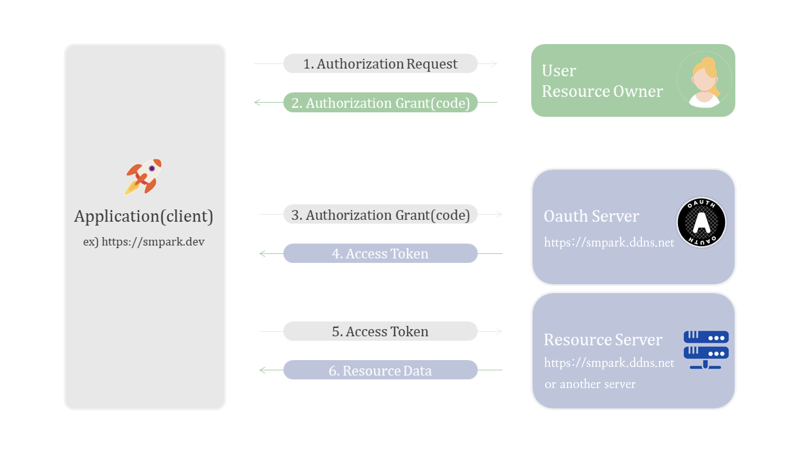
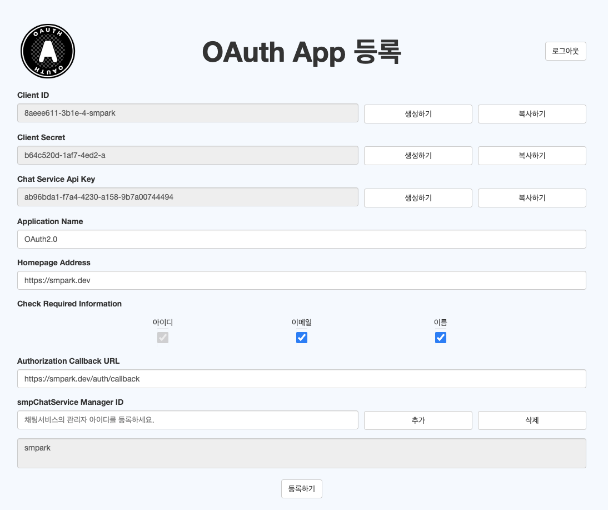
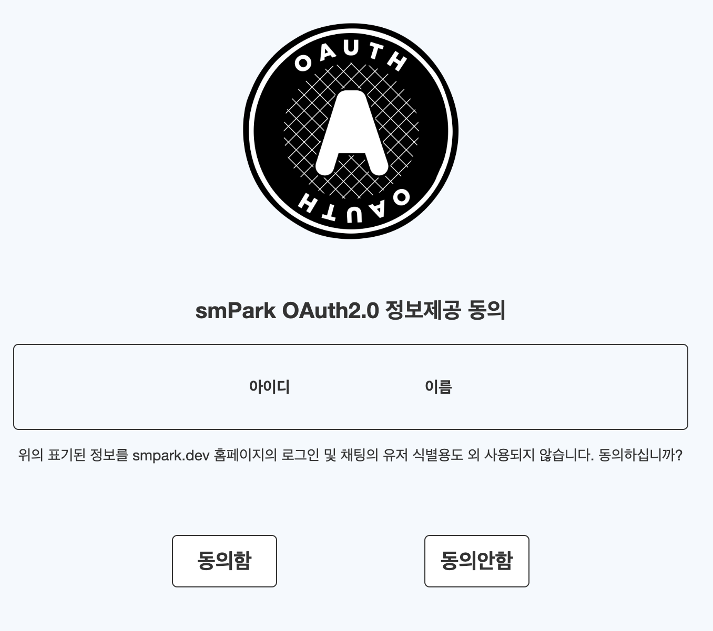
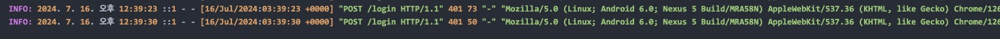
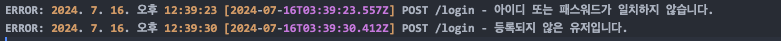

# SMPark OAuth2.0 Authorization Server
> **웹 보안과 아키텍처 원칙을 구현한 프로젝트**

## [🔐 Live Demo](https://smpark.site)

## Overview
OAuth2.0 표준([RFC-6749](https://datatracker.ietf.org/doc/html/rfc6749))을 기반으로 한 인증 서버입니다. 보안 모범 사례들(CSP, JWT 등)을 실제 구현하고, 클린 아키텍처와 DDD 원칙을 적용하여 구조적인 설계를 실현했습니다.

## Key Features
- 🔐 표준 OAuth2.0 인증 플로우
- 🛡️ CSP, XSS, CSRF, DOS 방어
- 🏗️ 클린 아키텍처 & DDD 기반 설계
- 🔄 CI/CD 파이프라인

### Usage

#### Quick Test Login
- [🚀 [smpark.dev]](https://smpark.dev) Login -> Smpark Login 클릭
- [🔐 [smpark.site]](https://smpark.site) ID: `tester`, PW: `1234` 입력 후 로그인


#### Quick Test Social Login
- [🔐 [smpark.site]](https://smpark.site) 회원가입 후 로그인
- [🔐 [smpark.site]](https://smpark.site) OAuth 페이지 작성 후, 적용 사이트에 소셜 로그인 로직 연동

<br>

---------------

<br>

## Key Features

### Security
- **OAuth 2.0 Implementation**
  - RFC-6749 표준 준수
  - 보안 권장사항 적용
  - 토큰 이원화 (Access/Refresh)

- **Security Measures**
  - CSP를 통한 리소스 제어
  - XSS/CSRF 방어
  - Rate Limiting으로 DoS 방지
  - Secure Cookie 설정

### Architecture
- **Clean Architecture**
  - 계층 분리를 통한 관심사 분리
  - 의존성 역전 원칙 적용
  - 테스트 용이성 확보

- **Domain-Driven Design**
  - 핵심 비즈니스 로직의 도메인 모델링
  - 유비쿼터스 언어 사용
  - Aggregate Root 패턴 적용

### DevOps
- **CI/CD Pipeline**
  - GitHub Actions 자동화
  - Docker 컨테이너화
  - Zero-Install로 배포 최적화

## IDE

## Tech Stack
### Core
   

### Database
 

### Development
   

### DevOps
  

### Testing
 

### Build


<br>

## Flow (OAuth 2.0)



<br>

#### Word

OAuth2.0에서 쓰이는 용어 설명입니다.

- `Client ID (client_id)` - 클라이언트 애플리케이션 식별을 위한 공개된 식별자.
- `Client Secret (client_secret)` - 클라이언트 애플리케이션을 인증하기 위한 비밀 키.
- `Scope` - 클라이언트가 접근하려는 리소스 서버의 자원 범위.
- `Response_type` - OAuth2.0 인증 플로우 선택. 현재 Code만 지원.
- `Authorization Callback URL (redirect_uri)` - 권한 부여 코드 또는 액세스 토큰을 전달받을 클라이언트의 URL.
- `Homepage Address` - 클라이언트의 홈페이지 URI로 동의 취소 시 리다이렉트 주소로 사용.
- `Access Token` - 리소스 서버에서 보호된 자원에 접근하기 위한 토큰. 유효 기간 15분 설정.
- `Refresh Token` - 새로운 액세스 토큰을 발급받기 위한 토큰. 유효 시간 1일 설정.
- `State` - 요청과 응답의 상태를 유지하고 무결성을 검증하기 위한 고유한 문자열로 클라이언트가 생성하여 제공.
- `Authorization Code` - 사용자의 권한 인증 후 발급되는 일회용 코드. 클라이언트는 이 코드로 액세스 토큰 요청.

<br>

## Secure

`smpark OAuth2.0 Server`를 제작하면서 가장 중점을 두었던 부분은 보안입니다.
아래와 같은 보안 검증을 구현하였습니다.

<br>

- `CSP` : 웹 애플리케이션에서 실행될 수 있는 리소스의 출처를 제한하는 보안 메커니즘으로, 서버가 HTTP 헤더를 통해 브라우저에 전달하는 정책입니다. 미들웨어를 통해 접속 요청 시 인증된 URI에만 제한을 완화하도록 동적으로 설정했습니다.

- ```javascript
  // CSP 정책 설정 예시 코드: 특정 출처에서만 리소스를 허용합니다.
  directives['form-action'] = ["'self'", addressUri];
  ```


- `CSRF` : CSP의 form-action 설정으로 승인되지 않은 도메인으로의 폼 제출을 방지하며, state를 사용하여 CSRF 공격을 방지하고 요청 상태를 유지합니다. 이를 위해 httpOnly, secure, sameSite 등의 쿠키 설정을 통해 클라이언트 접근을 차단하고, HTTPS에서만 접근을 허용하여 CSRF 공격에 대비했습니다.
- ```javascript
   directives['form-action'] = ["'self'", addressUri];
   setCookie(res: Response, options: ICookieOptions): Response {
    const {
      name,
      value,
      maxAge = Number(this.env.loginCookieExpiresIn) * 1000,
      httpOnly = true,
      secure = this.env.nodeEnv === 'production',
      sameSite = 'lax',
    } = options;

    return res.cookie(name, value, {
      maxAge,
      httpOnly,
      secure,
      sameSite,
    });
  }
  

  try {
    const { redirect_uri, state } = req;
    const code = await this.codeGenerationUseCase.execute(id);

    return res.redirect(`${redirect_uri}?code=${code}&state=${state}`);
  } catch (error) {
    next(error);
  }
  ```

<br>

- `redirect_uri` : 등록된 redirect_uri와 요청된 redirect_uri를 검증하여 위조된 redirect_uri로 인한 코드 탈취를 방지합니다. 이는 RFC 6819의 권장 사항을 따랐습니다.
  [[📑[rfc6819]](https://datatracker.ietf.org/doc/html/rfc6819#section-5.2.3.5)] 권고

  ```javascript
   if (tokenPrepare.redirect_uri !== clients.redirect_uri.getValue()) {
      throw new CustomError(401, ERROR_MESSAGES.VALIDATION.MISMATCH.REDIRECT_URI);
    }
  ```

<br>

- `xss` : CSP 설정을 통해 승인된 addressUri 외의 모든 스크립트 소스 로딩을 차단하여 XSS 공격을 방지합니다.

  ```javascript
  directives['script-src'] = ["'self'", addressUri];
  ```

<br>

- `DoS(Denial of Service)` : express-rate-limit 미들웨어를 사용해 특정 시간 동안 허용되는 요청 수를 제한하여 반복된 요청으로 인한 서버 마비를 방지했습니다.
  
  ```javascript
  const rateLimit = require('express-rate-limit');

  const rateLimiterMiddleware = rateLimit({
    windowMs: rateLimitWindowMs, // 1분
    max: maxRequestsPerWindow, // 1분 동안 최대 50번의 요청
    headers: true,
    message: ERROR_MESSAGES.RATE_LIMIT.EXCEEDED,
  });
  ```

<br>

- `Access Token & Refresh Token` : OAuth 2.0 인증 후 클라이언트에게 Access Token과 Refresh Token을 발급합니다. JWT 방식의 로그인으로 Access Token은 쿠키에, Refresh Token은 Redis에 저장하며, 프론트엔드로 토큰을 직접 전달하지 않는 방식을 통해 보안을 강화했습니다. Access Token의 유효 시간을 15분 이하로 설정해 탈취 시 피해를 최소화하며, 토큰 만료 시 Refresh Token으로 재발급하고 Refresh Token이 만료되면 재인증 절차를 거칩니다.

  ```javascript
  setCookie(res: Response, options: ICookieOptions): Response {
    const {
      name,
      value,
      maxAge = Number(this.envService.getLoginCookieExpiresIn()) * 1000,
      httpOnly = true,
      secure = this.envService.getNodeEnv() === 'production',
      sameSite = 'lax',
    } = options;

    return res.cookie(name, value, {
      maxAge,
      httpOnly,
      secure,
      sameSite,
    });
  }

  create(
    payload: ITokenPayload,
    options: ITokenOptions,
    tokenGenerator: IJsonWebTokenService,
  ) {
    return {
      accessToken: new AuthToken(
        tokenGenerator.generateToken(
          payload,
          options.accessToken.jwtSecretKey,
          options.accessToken.expiresIn,
        ),
      ),
      refreshToken: new AuthToken(
        tokenGenerator.generateToken(
          payload,
          options.refreshToken.jwtSecretKey,
          options.refreshToken.expiresIn,
        ),
      ),
    };
  }
  ```

<br>

## Usage

해당 사이트의 이용 방법 Flow 입니다.
1. 간단한 동작 확인은 [📝[smpark.dev]](https://smpark.dev)의 로그인 페이지에서 smpark 로그인을 선택하여 로그인하시면 됩니다
(ID:tester PW:1234)
2. OAuth2.0을 직접 연동하기 위해선 아래와 같은 준비가 필요합니다. 

#### Register

1. [📝[smpark.site]](https://smpark.site)에서 회원가입 후 로그인
2. Client ID, Client Secret 생성
3. Homepage Address, Authorization Callback URL, Check Required Information 항목 기재 후 등록


<br>

#### Client 토큰 요청 (Example FE JavaScript Code)

1. Flow 1: 클라이언트 웹페이지에서 OAuth Server로 URI 전송

- `OAuth Server`의 정보를 원하는 클라이언트 웹페이지에서 아래와 같은 방식으로 URI를 보냅니다.
  혹은 Next Auth 패키지의 도움을 받아 전달하여도 가능합니다.

```javascript
const client_id = process.env.CLIENT_ID;
const redirect_uri = process.env.REDIRECT_URI; // OAuth Server로 리디렉션할 URI를 생성
const state = uuidv4();
const scope = 'openid name email';
const response_type = 'code';


// uri redirect -> method GET
const uri = `https://smpark.site/oauth/authorize?client_id=${client_id}&redirect_uri=${redirect_uri}&state=${state}&scope=${scope}&response_type=${response_type}`;

window.location.href = uri;
```

2. Flow 1-1: `OAuth Server` 인증 과정 진행
   <br>
   
   <br>

3. Flow 1-2: 클라이언트에게 Scope 범위에 따른 정보 제공 동의 여부 묻기
   <br>
   <br>
   
   <br>

  <br>
4. Flow 2: 동의 후 클라이언트에게 code 전달(서버에서 자동으로 이루어짐)

<br>

```javascript
const { redirect_uri, state } = req;
const code = await this.codeGenerationUseCase.execute(id);

return res.redirect(`${redirect_uri}?code=${code}&state=${state}`);
```

<br>

5. Flow 3: 클라이언트는 전달받은 code와 state를 파싱하여 token 요청

```javascript
const response = await axios.post('https://smpark.site/oauth/token', {
  client_id: process.env.CLIENT_ID,
  client_secret: process.env.CLIENT_SECRET,
  code,
  state,
  redirect_uri: process.env.REDIRECT_URI,
  grant_type: 'authorization_code',
});
```

5. Flow 4: `OAuth Server`는 받은 code를 검증하고 `access_token`과 `refresh_token`을 생성하여 클라이언트에 전달

```javascript
  const tokens = await this.tokenOAuthIssuanceUseCase.execute(ids);
  return res.json({
    access_token: tokens.accessToken,
    refresh_token: tokens.refreshToken,
    token_type: 'Bearer',
  });
```

6. Flow 5: 클라이언트는 `Resource Server`에 요청할 때 `access_token`을 포함

```javascript
const response = await axios.get('https://smpark.store/scope', {
  headers: {
    Authorization: `Bearer ${accessToken}`,
  },
});
```

7. Flow 6: 리소스 서버는 `access_token`을 검증하고 동의된 Scope와 요청 Scope에 따라 클라이언트에 정보 전달

```javascript
  const authHeader = req.headers['authorization'];
  const token = authHeader && authHeader.split(' ')[1];

  ... (검증) ...

  res.json({ userData });
```

#### Log

`winston`과 `morgan`을 사용하여 접속과 에러 상황을 로그로 기록합니다. 또한, 콘솔에도 정보를 출력하여 개발을 원활하게 진행할 수 있도록 하였습니다.

```javascript
const consoleTransport = new winston.transports.Console({
  level: env.nodeEnv === 'production' ? 'warn' : 'debug',
  format: combine(colorize(), appendTimestamp({ tz: true }), simple()),
});
```

info.log


<br>

error.log


## ETC

### 1. Clean Architecture 

- **Infrastructure**  
  데이터베이스나 외부 API 통신 같은 외부 인프라와 관련된 구체적인 구현을 포함합니다. 이 레이어는 환경 설정과 외부 시스템과의 통신을 관리하여 애플리케이션의 외부 의존성을 처리합니다.

- **Interface-Adapter**  
  외부 인터페이스와 시스템 간 데이터 전달을 담당합니다. 웹 컨트롤러, DTO, API 엔드포인트 등이 위치하며 애플리케이션 레이어와의 중재 역할을 합니다. 이 레이어는 입력 데이터 검증을 수행하고 요청을 적절한 유스케이스로 전달합니다.

- **Application**  
  애플리케이션 서비스나 유스케이스를 정의하는 계층으로, 비즈니스 규칙에 따라 작업의 흐름을 조정합니다. 이 레이어는 핵심 로직을 포함하지 않으며, 주로 도메인 레이어와 상호작용하여 애플리케이션의 작업 단위(유스케이스)를 관리합니다. 트랜잭션 범위를 설정하거나 작업 순서를 제어하여 응집도 높은 유스케이스를 제공합니다.

- **Domain**  
  가장 내부에 위치한 계층으로, 핵심 비즈니스 로직과 규칙을 담당합니다. 엔티티, 값 객체, 도메인 서비스가 포함되며, 시스템의 비즈니스 규칙을 가장 순수한 형태로 유지합니다. 이 계층은 애플리케이션의 가장 중요한 도메인 로직을 캡슐화하여 외부와의 의존성을 최소화합니다.

### 2. Domain-Driven Design

**Domain-Driven Design (DDD)** 원칙을 적용하여 핵심 비즈니스 로직과 검증을 엔티티와 값 객체로 구현했습니다.

- **엔티티(Entity)**  
  루트 애그리거트(Aggregate Root)로서 외부와의 모든 통신을 담당하며, 외부 계층에서의 모든 요청은 엔티티를 통해 이루어집니다. 엔티티는 비즈니스 로직을 캡슐화하여 도메인의 일관성을 보장합니다.

- **값 객체(Value Object)**  
  엔티티 내에서만 동작하며, 변경 불가능한 속성을 통해 비즈니스 규칙을 표현합니다. 필요 시 엔티티에 포함되어 유효성 검사와 도메인 규칙을 수행합니다.


### 3. 의존성 주입, 의존성 역전

**Inversify** 라이브러리를 이용하여 컨테이너를 통해 의존성을 주입하고 자동으로 관리할 수 있도록 설정했습니다. 의존성 역전을 위해 추상화 계층의 위치를 조정했습니다.

### 4. 에러처리 및 로그 

**Custom Error** 간단한 Custom Error 클래스를 만들어 에러를 발생시키고, 필요한 데이터를 함께 전달할 수 있도록 했습니다. 최상위에서 한 번의 Try-Catch 블록을 사용하여 전역적으로 에러를 제어하며, 여기서 상태에 따라 로그를 처리했습니다.

### 5. 데이터 전송 

**DTO & Mappers** 외부 레이어(Interface-adapter)에서 내부 레이어(application)로 데이터를 전달할 때, DTO 클래스를 사용하여 기본적인 검증을 수행했습니다.
Service와 Repository 간 데이터를 주고받을 때는 Mapper를 사용하여 데이터를 값 객체 또는 엔티티로 변환하며, 이 변환 과정에서 도메인 규칙에 따른 상세한 검증을 거쳐 데이터를 전달하였습니다.

