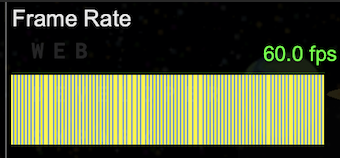
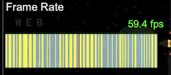
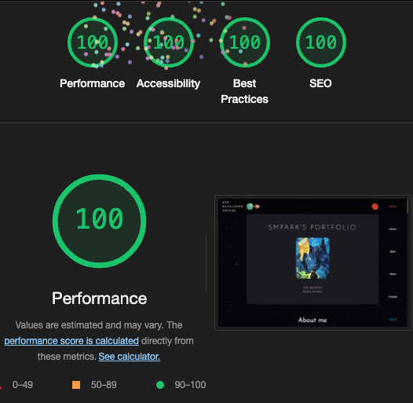

# SMPark Portfolio Site
> **웹 최적화와 Feature-Sliced Design을 적용한 포트폴리오 프로젝트**

## [🚀 Live Demo](https://smpark.dev)

## Overview
기능 분할 설계에 따라 폴더 구조를 나누고 배럴 패턴을 활용하여 단방향 의존성 구조를 구현한 포트폴리오 사이트입니다. OAuth 2.0 서버([🔐 smpark.site](https://smpark.site))와 연동했으며, 캔버스 기반 배경과 최적화된 이미지 로딩을 적용했습니다.


## Key Features
- 📊 캔버스 기반 인터랙티브 배경
- 🖼️ 최적화된 이미지 로딩 전략
- 🔄 OAuth 2.0 연동 로그인
- 📱 반응형 디자인

<br>

---------------

<br>

## 프로젝트 상세

개인 포트폴리오 사이트로 사용하는 홈페이지 입니다. ReactJS에서 Next.js로 마이그레이션 하였고 동시에 FSD 방법론을 적용하였습니다. 

## 주요 특징

- **기능 분할 설계**:
  기능 분할 설계에 따라 폴더 구조를 나누고 배럴 패턴을 사용해 모듈을 export하여 단방향 의존성 구조를 유지했습니다. FSD의 레이어 구조와 슬라이스 개념을 적용하여 각 기능의 독립성을 보장하고, 높은 응집도와 낮은 결합도를 통해 확장성과 재사용성을 고려한 설계를 구현했습니다.

- **Yarn PnP (Zero Install)**:
  설치 시간 단축과 용량 최소화, CI/CD 시간을 줄이기 위해 Zero Install을 사용했습니다.

- **TypeScript**:
  엄격한 정적 타입 체크를 통해 코드의 안정성과 가독성을 향상했습니다.

- **ESLint**:
  코드 품질과 일관성을 유지하기 위해 린팅 규칙을 적용했습니다. 저장 시 단축키를 통해 자동으로 `--fix`를 실행하여 코드를 정리하고, Import 문을 정해진 규칙에 따라 정렬하도록 설정했습니다.

- **Docker**:
  컨테이너화를 통해 개발 및 배포 환경의 일관성을 보장했습니다.

## Version

`smpark Portfolio Site`_(v1.0.0)_

## IDE

## Tech Stack
### Core
  

### Development
   

### DevOps
  


<br>

[🚀[smpark.dev]](https://smpark.dev) 사이트 이동

# 개요
- 개인 포트폴리오 사이트입니다. React에서 CSR로 제작된 프로젝트를 Next.js SSR로 마이그레이션 하였습니다. 
- 레이어드 아키텍처 -> 기능분할설계 아키텍처로 마이그레이션 하였습니다.
- 개인 OAuth2.0 서버와 연동하여 로그인 기능을 제공합니다. SMPark을 통해 로그인하면 메인 이미지가 추가됩니다. (클릭 시 이미지 회전)

<br>

# Optimization

## Canvas 최적화
### RAF vs SetInterval 성능 비교
- **RequestAnimationFrame 적용**
  - 안정적인 60fps 달성
  - 백그라운드 탭 자동 최적화
  - 브라우저 리페인트 주기 동기화

- **추가 최적화**
  - 리사이즈 이벤트 Debounce (200ms)
  - 메모리 누수 방지 (cleanup)

- Raf vs SetInterval 비교 결과 

  - Raf 사용
    1. 프레임 드롭이 발견되지 않음

    
    
    2. 브라우저 탭 이동 시 CPU를 사용하지 않음.

  - SetInterval 사용(16ms)
    
    1. 프레임 드롭 발견

    

    2. 브라우저 탭 이동 시 SetInterval의 경우 CPU 사용.

<br>

## 성능 최적화
### Lighthouse 성능 점수
| 환경 | 점수 | 상태 |
|------|------|------|
| 데스크탑 | 95-100 | 🟢 |
| 모바일 | 90-95 | 🟢 |

### 주요 성능 지표 (데스크탑/모바일)
- FCP: 0.3s / 1.4s
- LCP: 0.7s / 3.3s
- Speed Index: 0.3s / 1.4s
- TBT: 0ms
- CLS: 0

  

### 적용된 최적화 전략
  ```jsx
    // 반응형 이미지 최적화
    sizes='(max-width: 243px) 100vw, 243px'

    // 로딩 전략 최적화
    placeholder='blur'
    loading="lazy"
    blurDataURL={image.blurDataUrl}
  ```

  - WebP 포맷 사용
  - Lazy Loading 적용
  - Blur Placeholder 제공
  - 평균 이미지 크기: 50KB

### Trade-off 전략
  - LCP가 다소 높게 측정되었으나, 이는 의도된 전략
  - TBT를 0ms로 유지하여 페이지의 상호작용 성능 최대화
  - Lazy loading과 blur placeholder를 통한 사용자 경험 개선
  - 전체적인 리소스 사용 최적화


# Feature Sliced Design
[🚀[Feature-Sliced Design]](https://feature-sliced.design) FSD 공식 사이트

## 🔨 계층화된 구조
```bash
src/
├── app/          # 전역 설정, 프로바이더, 스타일
├── entities/     # 비즈니스 엔티티 (User, Product 등)
├── features/     # 기능 단위 (인증, 테마 등)
├── pages/        # 페이지 컴포넌트, 라우팅
├── shared/       # 공용 컴포넌트, 유틸리티
└── widgets/      # 독립적인 블록 (Header, Footer 등)
```

- FSD는 프론트엔드 아키텍처 방법론으로 애플리케이션을 기능(feature) 단위로 분할하고 계층화하는 설계 방식
- 클린 아키텍처, DDD와 많은 유사점으로 학습 및 사용이 쉬움

## Clean Architecture와의 유사점
- 계층형 구조
- 단방향 의존성 규칙
- 관심사의 분리
- 외부 의존성 격리

## DDD(Domain-Driven Design)와의 유사점
- 도메인 중심 설계
- 명확한 경계
- 유비쿼터스 언어 사용
- 컨텍스트 분리

## 공통점 
- 높은 응집도
- 낮은 결합도
- 비즈니스 로직 격리
- 테스트 용이성
- 유지보수 편의성

# 상태 관리 전략
- 🔄 서버 상태(React Query)
  ```typescript
    export const useGalleryImages = (enabled: boolean) => {
      return useQuery<IGalleryImage[]>({
        queryKey: ['gallery'],
        queryFn: galleryApi.getAllImages,
        enabled,
      });
    };
  ```
- 💾 전역 상태(Zustand)
  ```typescript
    export const useLayoutStore = create<IUseLayoutStore>((set) => ({
      mainRef: null,
      headerRef: null,
      setHeaderRef: (ref) => set({ headerRef: ref }),
      setMainRef: (ref) => set({ mainRef: ref }),
    }));
  ```
- 📌 로컬 상태(useState)
  ```typescript
    export const LoginButtons = () => {
      const [isLoading, setIsLoading] = useState(false);
      const [loadingProvider, setLoadingProvider] = useState('');
    };
  ```